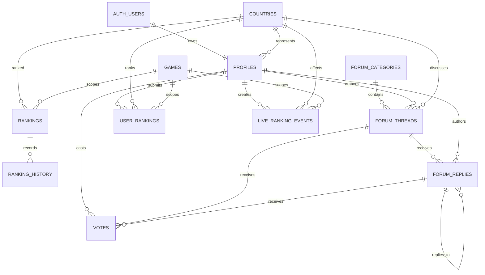

# SkillAtlas Database and Account Architecture

> **Status:** PR 1 implements only the local Supabase foundation and Supabase-managed verified email authentication. The domain schema below remains approved future architecture, not an implemented schema.

## Current implementation

- Supabase Auth owns account identity in its managed `auth` schema.
- The application supports verified email OTP request, verification, session refresh, minimal `/account` state, and sign-out.
- No `public.profiles`, countries, rankings, Forum, voting, or User Rankings persistence table is implemented by PR 1.
- The local `supabase/` foundation contains no account-domain migration yet.
- The existing optional hosted `skillatlas_page_comments` integration in `app/theme-provider.tsx` is unchanged. Its exact hosted schema and RLS policies were not available for safe verification, so the repository does not claim to reproduce it.

## Approved future architecture

The tables, relationships, indexes, and RLS policies below are proposed future work. The application must not assume these public tables exist until their reviewed migrations and policy tests land.

## Design principles

- Keep the initial data model country-level. Do not add states, provinces, cities, or districts.
- Use Supabase Auth as the identity source and a separate public profile table for application data.
- Use UUID primary keys for domain records and `timestamptz` for timestamps stored in UTC.
- Use `created_at` and `updated_at` consistently; add `deleted_at` only where recoverable moderation or deletion is required.
- Prefer foreign keys and check constraints over unenforced application assumptions.
- Treat cached counts and aggregate scores as derived data maintained by trusted database functions or jobs.
- Enable RLS on every table exposed through the Supabase API.

## Relationships at a glance

## Tables

### `public.profiles`

**Purpose:** Public SkillAtlas profile data linked one-to-one with Supabase Auth. Authentication secrets and provider data remain in `auth.users`.

**Important columns**

- `id uuid primary key references auth.users(id) on delete cascade`
- `username text not null`
- `display_name text not null`
- `avatar_url text`
- `country_id uuid references countries(id) on delete set null`
- `bio text`
- `role text not null default 'member'` with allowed values such as `member`, `moderator`, and `admin`
- `reputation integer not null default 0`
- `created_at timestamptz`, `updated_at timestamptz`

**Relationships:** One Auth identity owns one profile. A user may represent one country and may author threads, replies, votes, user rankings, and live events.

**Likely indexes:** Unique index on `lower(username)`; indexes on `country_id`, `role`, and `created_at`.

**RLS:** Public users may read safe profile fields. Authenticated users may insert or update only their own profile. Role and reputation changes require a trusted function or service role. Do not store private account data such as email in this public table.

### `public.countries`

**Purpose:** Canonical country catalogue used throughout maps, rankings, profiles, and community content.

**Important columns**

- `id uuid primary key`
- `iso2 text not null`, `iso3 text not null`
- `slug text not null`, `name text not null`
- `region text`, `flag_asset text`
- `is_active boolean not null default true`
- `created_at timestamptz`, `updated_at timestamptz`

**Relationships:** Referenced by profiles, rankings, threads, user rankings, and live ranking events.

**Likely indexes:** Unique indexes on `iso2`, `iso3`, and `slug`; index on `(is_active, name)`.

**RLS:** Public read access for active countries. Only admins or service processes may create, rename, deactivate, or delete catalogue records. Prefer deactivation over deletion once a country is referenced.

### `public.games`

**Purpose:** Canonical list of games available for ranking and analysis.

**Important columns**

- `id uuid primary key`
- `slug text not null`, `name text not null`
- `genre text`, `publisher text`
- `icon_asset text`
- `is_active boolean not null default true`
- `created_at timestamptz`, `updated_at timestamptz`

**Relationships:** Referenced by rankings, user rankings, and live ranking events. A null `game_id` in those tables can represent an overall, all-games scope.

**Likely indexes:** Unique index on `slug`; index on `(is_active, name)`; optional index on `genre` when filtering becomes common.

**RLS:** Public read access for active games. Catalogue writes are limited to admins or service processes.

### `public.rankings`

**Purpose:** Current authoritative country ranking for each game, ranking type, and reporting period.

**Important columns**

- `id uuid primary key`
- `country_id uuid not null references countries(id)`
- `game_id uuid references games(id)`; null means overall
- `ranking_type text not null` such as `official`, `community`, or `live`
- `period text not null` such as `all_time`, `30d`, or `7d`
- `position integer not null check (position > 0)`
- `score numeric not null`
- `sample_size integer`, `methodology_version text`
- `calculated_at timestamptz not null`, `updated_at timestamptz`

**Relationships:** Each row ranks one country in one scope. One current ranking has many ranking history records.

**Likely indexes:** A `UNIQUE NULLS NOT DISTINCT` constraint on `(country_id, game_id, ranking_type, period)`; another on `(game_id, ranking_type, period, position)`; query indexes on `(game_id, ranking_type, period, score desc)` and `(country_id, calculated_at desc)`.

**RLS:** Public read access. Only trusted ranking jobs, admins, or carefully scoped database functions may write. Clients must not directly set official scores or positions.

### `public.ranking_history`

**Purpose:** Append-only snapshots used for trend lines, rank movement, audits, and methodology comparisons.

**Important columns**

- `id bigint generated always as identity primary key`
- `ranking_id uuid not null references rankings(id) on delete cascade`
- `position integer not null`, `score numeric not null`
- `methodology_version text`
- `recorded_at timestamptz not null default now()`

**Relationships:** Many snapshots belong to one current ranking record.

**Likely indexes:** Unique index on `(ranking_id, recorded_at)`; index on `(ranking_id, recorded_at desc)`; a BRIN index on `recorded_at` if the event volume becomes large.

**RLS:** Public read access when ranking history is public. Inserts are restricted to trusted ranking jobs; client updates and deletes should be denied to preserve audit history.

### `public.forum_categories`

**Purpose:** Ordered forum sections such as General, Rankings, Countries, Players, and Suggestions.

**Important columns**

- `id uuid primary key`
- `slug text not null`, `name text not null`
- `description text`
- `sort_order integer not null default 0`
- `is_active boolean not null default true`
- `created_at timestamptz`, `updated_at timestamptz`

**Relationships:** One category contains many forum threads.

**Likely indexes:** Unique index on `slug`; index on `(is_active, sort_order)`.

**RLS:** Public read access for active categories. Category management is restricted to moderators or admins.

### `public.forum_threads`

**Purpose:** Persistent forum discussions with category, author, status, country context, tags, and activity metadata.

**Important columns**

- `id uuid primary key`
- `category_id uuid not null references forum_categories(id)`
- `author_id uuid references profiles(id) on delete set null`
- `country_id uuid references countries(id) on delete set null`
- `title text not null`, `body text not null`, `slug text`
- `tags text[] not null default '{}'`
- `status text not null default 'open'` such as `open`, `answered`, `locked`, `archived`, or `removed`
- `is_pinned boolean not null default false`
- Cached `reply_count integer`, `vote_score integer`, and `view_count bigint`
- `last_activity_at timestamptz`, `created_at timestamptz`, `updated_at timestamptz`, `deleted_at timestamptz`

**Relationships:** Belongs to a category, author, and optional country. Has many replies and votes.

**Likely indexes:** `(category_id, status, is_pinned desc, last_activity_at desc)`; `(author_id, created_at desc)`; `(country_id, last_activity_at desc)`; GIN index on `tags`; GIN full-text index over `title` and `body`; optional unique index on `slug` if public URLs use it.

**RLS:** Public read access only for visible threads. Authenticated users may create threads as themselves and edit their own content within defined limits. Moderators may pin, lock, archive, or remove content. Cached counts and view increments require trusted functions rather than unrestricted client updates.

### `public.forum_replies`

**Purpose:** Replies within forum threads, including optional nested reply context and moderation state.

**Important columns**

- `id uuid primary key`
- `thread_id uuid not null references forum_threads(id) on delete cascade`
- `author_id uuid references profiles(id) on delete set null`
- `parent_reply_id uuid references forum_replies(id) on delete set null`
- `body text not null`
- `status text not null default 'visible'` such as `visible`, `hidden`, or `removed`
- Cached `vote_score integer not null default 0`
- `created_at timestamptz`, `updated_at timestamptz`, `deleted_at timestamptz`

**Relationships:** Belongs to one thread and author. May reference another reply and may receive votes.

**Likely indexes:** `(thread_id, created_at)`; `(author_id, created_at desc)`; `parent_reply_id`; partial index for visible replies by thread.

**RLS:** Public read access for visible replies in visible threads. Authenticated users may reply as themselves and edit their own content within policy limits. Moderators may hide or remove replies. Users must not directly change moderation status or cached vote scores.

### `public.votes`

**Purpose:** Persistent upvotes and downvotes on forum threads or replies.

**Important columns**

- `id uuid primary key`
- `user_id uuid not null references profiles(id) on delete cascade`
- `thread_id uuid references forum_threads(id) on delete cascade`
- `reply_id uuid references forum_replies(id) on delete cascade`
- `value smallint not null check (value in (-1, 1))`
- `created_at timestamptz`, `updated_at timestamptz`
- Check constraint `num_nonnulls(thread_id, reply_id) = 1`

**Relationships:** One user casts a vote on exactly one thread or reply.

**Likely indexes:** Partial unique index on `(user_id, thread_id)` where `thread_id is not null`; partial unique index on `(user_id, reply_id)` where `reply_id is not null`; indexes on `thread_id` and `reply_id` for aggregation.

**RLS:** Authenticated users may read votes as product policy permits and insert, update, or delete only their own vote. Anonymous voting should be disabled initially. Aggregate scores should be updated through a transaction-safe database function or trigger.

### `public.user_rankings`

**Purpose:** Stores each user's country placement or score for an overall or game-specific community ranking.

**Important columns**

- `id uuid primary key`
- `user_id uuid not null references profiles(id) on delete cascade`
- `country_id uuid not null references countries(id)`
- `game_id uuid references games(id)`; null means overall
- `position integer not null check (position > 0)`
- `score numeric`, `reason text`
- `is_public boolean not null default true`
- `created_at timestamptz`, `updated_at timestamptz`

**Relationships:** One row represents one user's placement of one country in a ranking scope. Aggregated community rankings can be derived from these rows.

**Likely indexes:** `UNIQUE NULLS NOT DISTINCT` on `(user_id, country_id, game_id)` and `(user_id, game_id, position)`; indexes on `(game_id, country_id)`, `(country_id, updated_at desc)`, and `(user_id, game_id, position)`.

**RLS:** Users may create, update, and delete only their own ranking rows. Public reads should include only published rows or, preferably, expose aggregate views rather than raw voting history. Trusted functions calculate community scores and prevent users from writing aggregate results directly.

### `public.live_ranking_events`

**Purpose:** Append-only event stream for real-time country ranking activity, movement feeds, and reproducible live score calculation.

**Important columns**

- `id bigint generated always as identity primary key`
- `session_id uuid not null` to group one live ranking session
- `actor_user_id uuid references profiles(id) on delete set null`
- `country_id uuid not null references countries(id)`
- `game_id uuid references games(id)`; null means overall
- `event_type text not null` such as `move`, `upvote`, `downvote`, `score_adjustment`, or `snapshot`
- `value numeric`, `previous_position integer`, `new_position integer`
- `client_event_id uuid` for idempotency
- `metadata jsonb not null default '{}'`
- `occurred_at timestamptz not null default now()`

**Relationships:** Each event affects one country in an overall or game-specific live session and may be attributed to one user. A dedicated `live_ranking_sessions` table can be added later if session ownership and lifecycle require it.

**Likely indexes:** `(session_id, occurred_at)`; `(game_id, occurred_at desc)`; `(country_id, occurred_at desc)`; unique index on `client_event_id` when present; BRIN index on `occurred_at` at high volume.

**RLS:** Clients may append only validated events attributed to themselves, ideally through a rate-limited database function or server endpoint. Direct updates and deletes should be denied. Public event reads should expose only fields safe for the movement feed; trusted processes calculate and publish live aggregates.

## RLS and security priorities

Before connecting application features, the implementation should include:

1. RLS enabled with explicit policies on every public table.
2. A tested authorization helper for moderator and admin checks instead of duplicating role logic in every policy.
3. Server-controlled ranking calculations, counters, moderation fields, and role changes.
4. Rate limits and abuse controls for thread creation, replies, votes, and live events.
5. Policy tests covering anonymous users, members, content owners, moderators, admins, and service jobs.
6. Aggregate views or RPC functions that avoid exposing unnecessary individual voting activity.

## Suggested implementation order

1. Countries, games, Auth integration, and public user profiles.
2. Current rankings and ranking history.
3. Forum categories, threads, replies, moderation rules, and votes.
4. User ranking submissions and trusted community aggregates.
5. Live ranking events and real-time aggregation.
6. Performance tuning based on real query plans and production usage rather than speculative indexes.

Each stage should be delivered through reviewed migrations with rollback notes, seeded development data, RLS tests, and application changes in the same feature branch. None of those implementation steps are performed by this document.
